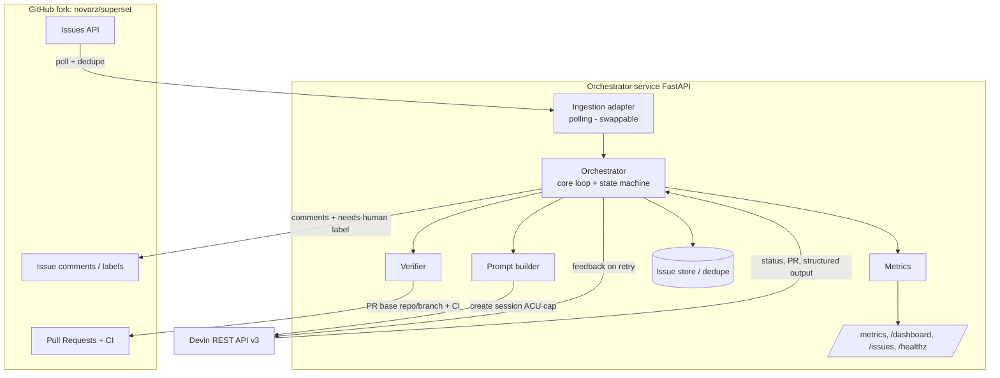
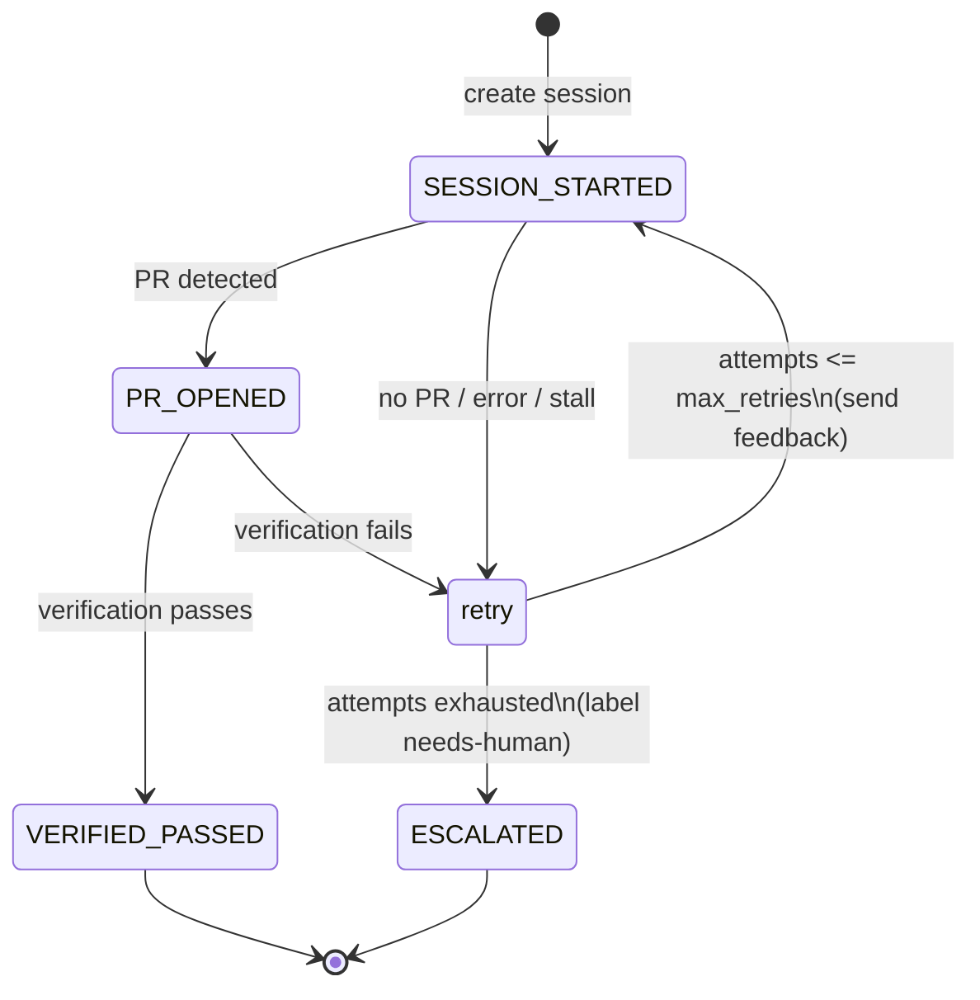

# Devin Issue Orchestrator

An event-driven service that automatically remediates GitHub issues filed on a
fork of Apache Superset by orchestrating **Devin sessions through the Devin REST
API (v3)** — not Devin's native GitHub integration.

> **Hard boundary:** this service contains *zero* logic that edits Superset
> source code. Every code change is produced by a Devin session. The
> orchestrator only polls issues, creates/steers sessions, verifies the
> resulting PRs, and writes status back to GitHub.

## The loop

1. **Ingestion (swappable):** a polling adapter polls the GitHub Issues API,
   dedupes seen issue IDs, and emits an internal `IssueEvent`. The
   `IngestionAdapter` interface lets a webhook handler drop in later — no inbound
   public URL is required by the default.
2. **Scoping:** each issue is turned into a Devin prompt containing the issue
   body **and** explicit acceptance criteria (pure, testable logic in
   `prompt.py`).
3. **Session creation:** a Devin session is created via the v3 API with a
   mandatory **ACU cap**; the session id is persisted against the issue.
4. **Status polling:** the session is polled until terminal; the PR / structured
   output is read from the session payload.
5. **Verification:** confirm a PR was opened against the correct repo/branch and
   (optionally) await the fork's CI on the PR head SHA.
6. **GitHub status trail:** bot comments are posted at every transition —
   session started (+ link), PR opened (+ link), verification passed/failed.
7. **Retry/escalation:** on failure or stall, the failure is commented, a
   corrective feedback message is sent to the session, and the issue is retried
   up to a **retry cap** (default 2). After the cap, the issue is labeled
   `needs-human`. No infinite loops.
8. **Metrics:** success rate, time-to-PR, ACU cost per issue, and retry counts
   are exposed at `GET /metrics` (JSON) and a minimal HTML dashboard at
   `GET /dashboard`.

## Architecture



### Retry / escalation state machine



## Module layout

```
devin_orchestrator/
  app.py              FastAPI app + endpoints, lifespan wiring
  config.py           env-only settings (no secrets in code)
  models.py           IssueEvent, TrackedIssue, enums
  ingestion/
    base.py           IngestionAdapter interface (webhook drop-in later)
    polling.py        GitHub Issues poller + dedupe
  prompt.py           issue -> prompt + acceptance criteria (pure)
  clients/
    devin.py          Devin v3 client (create/get/message) + timeouts
    github.py         issues/comments/labels/PR/CI (read-only on code)
  state_machine.py    pure retry/escalation decision
  orchestrator.py     core loop tying it together
  verification.py     PR repo/branch check + optional CI await
  metrics.py          counters/timings
  store.py            in-memory issue->session map + dedupe
  dashboard.py        minimal HTML dashboard
  runner.py           background poll loop
tests/                prompt-gen, state machine, dedupe, core loop
```

## Run it

### With Docker (recommended)

```bash
cp .env.example .env      # then edit values
docker compose up --build
```

The service listens on `http://localhost:8000`. No manual steps beyond setting
env vars are required.

- Health: `GET http://localhost:8000/healthz`
- Metrics (JSON): `GET http://localhost:8000/metrics`
- Dashboard (HTML): `GET http://localhost:8000/dashboard`
- Tracked issues: `GET http://localhost:8000/issues`

### Local (without Docker)

```bash
python -m venv .venv && source .venv/bin/activate
pip install -r requirements-dev.txt
set -a && source .env && set +a
uvicorn devin_orchestrator.app:app --reload --port 8000   # run from repo root
```

## Configuration

All configuration is via environment variables — see
[`.env.example`](.env.example) for the full list. Required: `GITHUB_TOKEN`,
`GITHUB_REPO`, and (unless `DRY_RUN=true`) `DEVIN_API_KEY` + `DEVIN_ORG_ID`.

Secrets are never committed or logged. The `GITHUB_TOKEN` needs issue write
(comments + labels) and pull-request/commit-status read on the fork. The
`DEVIN_API_KEY` is a service-user token (`cog_...`) for the v3 API.

## Logging

Logs narrate the full lifecycle of every issue, one line per transition:

```
12:00:01 i INFO    orch.app               🛰️  Poller started via 'polling' adapter (interval=60s)
12:00:01 i INFO    orch.orchestrator      📥 INGESTED issue #42 — 'Fix flaky chart'
12:00:02 i INFO    orch.orchestrator      🚀 SESSION started for issue #42 | id=devin-… | acu_cap=10
12:01:10 i INFO    orch.orchestrator      🔀 PR OPENED for issue #42 | https://… | time-to-PR=68s
12:01:12 i INFO    orch.orchestrator      ✅ VERIFICATION passed for issue #42 — PR targets master | CI=success
12:01:12 i INFO    orch.orchestrator      🎉 DONE issue #42 remediated in 1 attempt(s) | 3.0 ACU | time-to-PR=68s
```

Controlled via env vars:

- `LOG_LEVEL` — `DEBUG` | `INFO` | `WARNING` | `ERROR` (default `INFO`).
- `LOG_FORMAT` — `demo` (colourful, icons; default) or `plain` (for log shippers).
- `LOG_COLOR` — `1`/`0` to force colour (default: auto-detect TTY; `NO_COLOR` honoured).

## Tests

```bash
pip install -r requirements-dev.txt
python -m pytest -v
```

Tests cover prompt generation, the retry/escalation state machine, event
dedupe, and the full core loop (happy path, simulated failure → feedback →
retry → escalation, and verification failure) using fakes — no network access.

## Devin v3 API endpoints used

| Purpose | Endpoint |
| --- | --- |
| Create session (prompt + ACU cap) | `POST /v3/organizations/{org_id}/sessions` |
| Get session (status, PRs, output) | `GET /v3/organizations/{org_id}/sessions/{devin_id}` |
| Send corrective feedback | `POST /v3/organizations/{org_id}/sessions/{devin_id}/messages` |

Authentication is `Authorization: Bearer <cog_ service-user token>`.
