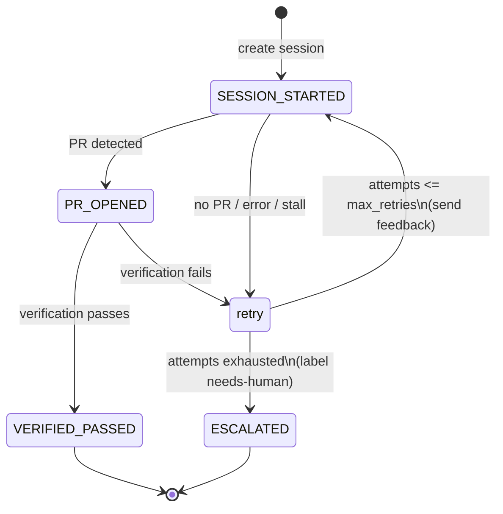

# Devin Issue Orchestrator

An event-driven service that automatically remediates GitHub issues filed on a
fork of Apache Superset by orchestrating **Devin sessions through the Devin REST
API (v3)** — not Devin's native GitHub integration.

> **Hard boundary:** this service contains *zero* logic that edits Superset
> source code. Every code change is produced by a Devin session. The
> orchestrator only polls issues, creates/steers sessions, verifies the
> resulting PRs, and writes status back to GitHub.

## The loop

1. **Ingestion (swappable):** a polling adapter polls the GitHub Issues API,
   dedupes seen issue IDs, and emits an internal `IssueEvent`. The
   `IngestionAdapter` interface lets a webhook handler drop in later — no inbound
   public URL is required by the default.
2. **Scoping:** each issue is turned into a Devin prompt containing the issue
   body **and** explicit acceptance criteria (pure, testable logic in
   `prompt.py`).
3. **Session creation:** a Devin session is created via the v3 API with a
   mandatory **ACU cap**; the session id is persisted against the issue.
4. **Status polling:** the session is polled until terminal; the PR / structured
   output is read from the session payload.
5. **Verification:** confirm a PR was opened against the correct repo/branch and
   (optionally) await the fork's CI on the PR head SHA.
6. **GitHub status trail:** bot comments are posted at every transition —
   session started (+ link), PR opened (+ link), verification passed/failed.
7. **Retry/escalation:** on failure or stall, the failure is commented, a
   corrective feedback message is sent to the session, and the issue is retried
   up to a **retry cap** (default 2). After the cap, the issue is labeled
   `needs-human` and (optionally) assigned to the GitHub user(s) in
   `ESCALATION_ASSIGNEE`. No infinite loops.
8. **Metrics:** success rate, time-to-PR, ACU cost per issue, and retry counts
   are exposed at `GET /metrics` (JSON) and a minimal HTML dashboard at
   `GET /dashboard`.

## Architecture


### Retry / escalation state machine



## Module layout

```
devin_orchestrator/
  app.py              FastAPI app + endpoints, lifespan wiring
  log_stream.py       in-memory log broker + SSE streaming
  logs_view.py        HTML viewer for GET /logs
  config.py           env-only settings (no secrets in code)
  models.py           IssueEvent, TrackedIssue, enums
  ingestion/
    base.py           IngestionAdapter interface (webhook drop-in later)
    polling.py        GitHub Issues poller + dedupe
  prompt.py           issue -> prompt + acceptance criteria (pure)
  clients/
    devin.py          Devin v3 client (create/get/message) + timeouts
    github.py         issues/comments/labels/PR/CI (read-only on code)
  state_machine.py    pure retry/escalation decision
  orchestrator.py     core loop tying it together
  verification.py     PR repo/branch check + optional CI await
  metrics.py          counters/timings
  store.py            in-memory issue->session map + dedupe
  dashboard.py        minimal HTML dashboard
  runner.py           background poll loop
tests/                prompt-gen, state machine, dedupe, core loop
```

## Run it

### With Docker (recommended)

```bash
cp .env.example .env      # then edit values
docker compose up --build
```

The service listens on `http://localhost:8000`. No manual steps beyond setting
env vars are required.

- Health: `GET http://localhost:8000/healthz`
- Metrics (JSON): `GET http://localhost:8000/metrics`
- Dashboard (HTML): `GET http://localhost:8000/dashboard`
- Tracked issues: `GET http://localhost:8000/issues`
- Live logs (HTML viewer): `GET http://localhost:8000/logs`
- Live logs (SSE stream): `GET http://localhost:8000/logs/stream`

### Local (without Docker)

```bash
python -m venv .venv && source .venv/bin/activate
pip install -r requirements-dev.txt
set -a && source .env && set +a
uvicorn devin_orchestrator.app:app --reload --port 8000   # run from repo root
```

## Configuration

All configuration is via environment variables — see
[`.env.example`](.env.example) for the full list. Required: `GITHUB_TOKEN`,
`GITHUB_REPO`, and (unless `DRY_RUN=true`) `DEVIN_API_KEY` + `DEVIN_ORG_ID`.

Secrets are never committed or logged. The `GITHUB_TOKEN` needs issue write
(comments + labels) and pull-request/commit-status read on the fork. The
`DEVIN_API_KEY` is a service-user token (`cog_...`) for the v3 API.

## Devin authentication setup

The orchestrator calls the **v3 organization API** with a **service-user** token
(not a legacy `apk_…` personal/service key — those are deprecated and tied to
v1/v2). Steps:

1. **Create a service user.** In Devin, go to **Settings → Service users → Create
   service user**. Give it a name (e.g. `issue-orchestrator`) and a role
   (`Member` is enough for creating sessions).
2. **Generate its API key.** From the service user, create an API key — it starts
   with `cog_`. Put it in `DEVIN_API_KEY`. (Migrating off a legacy `apk_…` key?
   Just swap it for this `cog_…` one.)
3. **Get your org ID.** It's shown on the **Settings → Service users** page and
   starts with `org-`. Put it in `DEVIN_ORG_ID`.
4. *(Optional)* **Attribute sessions to a human.** By default sessions are owned
   by the service user, so they don't show up in a person's "My sessions" list.
   To attribute each remediation session to a real human, set
   `DEVIN_CREATE_AS_USER_ID` to their user ID (prefix `user-`). This is a plain
   env var — nothing is hard-coded — so **anyone testing the orchestrator just
   sets their own user ID** and the sessions appear under their account. Leave it
   empty to attribute to the service user.

   Requirements for attribution to work:
   - The API key must belong to a service user whose role has the
     **`ImpersonateOrgSessions`** permission. The built-in **`Admin`** role
     includes it; custom roles that grant it require an Enterprise/Team plan, so
     on standard orgs use an Admin-role service user dedicated to this service.
   - The target user must have `UseDevinSessions`.

   **Finding your `user-` ID:** the org member settings show it, but the simplest
   way is to read it from a session *you* created — `GET /v3/organizations/{org}/
   sessions/{id}` returns a `user_id` field (sessions created by a service user
   show `user_id: bot_apk`). If attribution isn't permitted you'll get
   `403 {"detail":"Unauthorized"}` on session creation — that means the role is
   missing `ImpersonateOrgSessions`.

Smoke-test the credentials before running the service:

```bash
export DEVIN_ORG_ID=org-xxx
curl -X POST "https://api.devin.ai/v3/organizations/$DEVIN_ORG_ID/sessions" \
  -H "Authorization: Bearer $DEVIN_API_KEY" \
  -H "Content-Type: application/json" \
  -d '{"prompt": "Say hello", "max_acu_limit": 1}'
```

A `200` with a `session_id` means auth is good. See the
[migration guide](https://docs.devin.ai/api-reference/getting-started/migration-guide)
and [session attribution](https://docs.devin.ai/api-reference/overview#session-attribution)
docs.

> **Heads up:** Devin has announced Personal Access Tokens (PATs) are "coming
> soon" — once available, you'll be able to authenticate directly as a user
> without a service user or `create_as_user_id`.

### Structured output

By default (`DEVIN_STRUCTURED_OUTPUT=true`) the orchestrator passes a
`structured_output_schema` and sets `structured_output_required=true`, asking each
session to return a typed result:

```json
{ "acceptance_criteria_met": true, "pr_url": "https://…", "summary": "…", "unresolved": null }
```

Verification reads `pr_url` from this as a fallback (in addition to the native
`pull_requests` array), the `summary` is posted to the GitHub issue, and any
`unresolved` note is logged. Set `DEVIN_STRUCTURED_OUTPUT=false` to disable.

### Session completion in an autonomous pipeline

There is no human inside a session to answer prompts, so a session that finishes
its work often lands in `running` / `status_detail=waiting_for_user` rather than a
hard `exit`. The orchestrator treats a session as **done** when it reports a
*completed* `structured_output` (a `pr_url` or `acceptance_criteria_met=true`) or
is `waiting_for_user` with a PR already open, then **terminates** the session so it
doesn't idle until the timeout. Note that `structured_output` may be submitted
mid-task with an interim payload (e.g. `pr_url=null, acceptance_criteria_met=false`
while pre-commit runs), so its mere presence is not treated as completion. The only
"input" a session ever receives is the orchestrator's own corrective feedback on
the retry path — humans interact via the GitHub issue/PR, not the session.

## Logging

Logs narrate the full lifecycle of every issue, one line per transition:

```
12:00:01 i INFO    orch.app               🛰️  Poller started via 'polling' adapter (interval=60s)
12:00:01 i INFO    orch.orchestrator      📥 INGESTED issue #42 — 'Fix flaky chart'
12:00:02 i INFO    orch.orchestrator      🚀 SESSION started for issue #42 | id=devin-… | acu_cap=10
12:01:10 i INFO    orch.orchestrator      🔀 PR OPENED for issue #42 | https://… | time-to-PR=68s
12:01:12 i INFO    orch.orchestrator      ✅ VERIFICATION passed for issue #42 — PR targets master | CI=success
12:01:12 i INFO    orch.orchestrator      🎉 DONE issue #42 remediated in 1 attempt(s) | 3.0 ACU | time-to-PR=68s
```

Controlled via env vars:

- `LOG_LEVEL` — `DEBUG` | `INFO` | `WARNING` | `ERROR` (default `INFO`).
- `LOG_FORMAT` — `demo` (colourful, icons; default) or `plain` (for log shippers).
- `LOG_COLOR` — `1`/`0` to force colour (default: auto-detect TTY; `NO_COLOR` honoured).
- `LOG_BUFFER_SIZE` — number of recent log lines kept in memory for the live
  viewer (default `500`).

### Live log streaming (for demos)

The same lifecycle logs are streamed over the network so you can watch them in a
browser instead of tailing a terminal:

- `GET /logs` — a self-contained HTML viewer (dark "terminal", auto-scroll with a
  pause toggle, colourised by level) that subscribes to the stream below.
- `GET /logs/stream` — a [Server-Sent Events](https://developer.mozilla.org/docs/Web/API/Server-sent_events)
  endpoint. On connect it replays the last `LOG_BUFFER_SIZE` lines, then pushes
  each new line live (with periodic keep-alive comments). Consume it from the
  browser viewer, `curl -N http://localhost:8000/logs/stream`, or any SSE client.

Lines are buffered in memory and fanned out to every connected client by an
in-process broker (`log_stream.py`), so this works without any external log
infrastructure. ANSI colour is stripped from the streamed copy.

## Tests

```bash
pip install -r requirements-dev.txt
python -m pytest -v
```

Tests cover prompt generation, the retry/escalation state machine, event
dedupe, and the full core loop (happy path, simulated failure → feedback →
retry → escalation, and verification failure) using fakes — no network access.

## Devin v3 API endpoints used

| Purpose | Endpoint |
| --- | --- |
| Create session (prompt + ACU cap) | `POST /v3/organizations/{org_id}/sessions` |
| Get session (status, PRs, output) | `GET /v3/organizations/{org_id}/sessions/{devin_id}` |
| Send corrective feedback | `POST /v3/organizations/{org_id}/sessions/{devin_id}/messages` |

Authentication is `Authorization: Bearer <cog_ service-user token>`.
